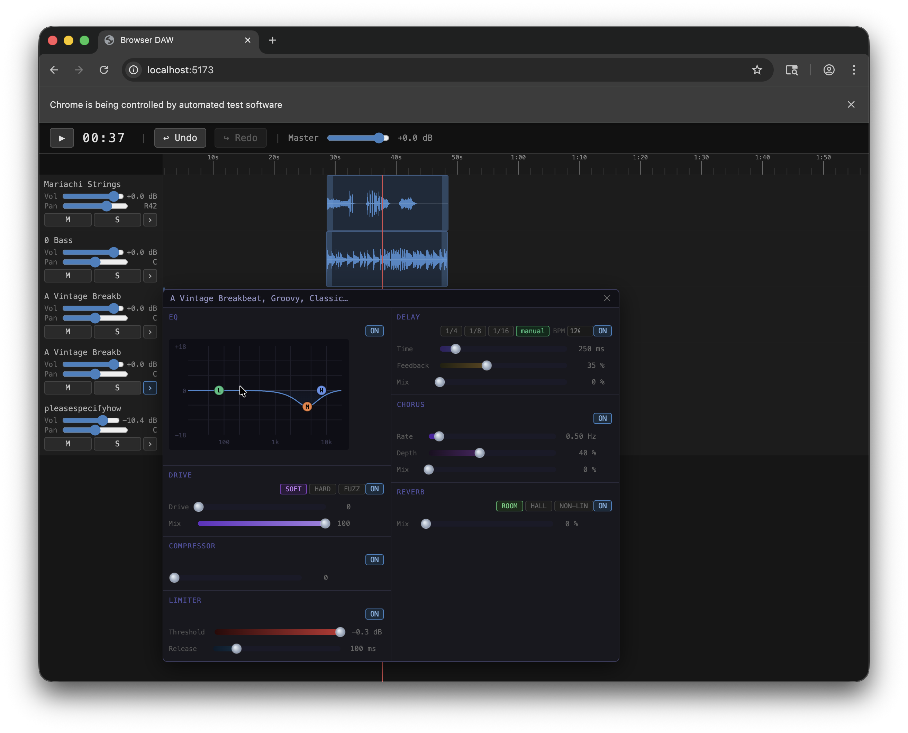

# browser-daw

A browser-based multitrack audio workstation built on WebAssembly, AudioWorklet, and React.



---

## Overview

The audio engine is written in C and compiled to WASM via Emscripten. It runs on the dedicated audio thread inside an `AudioWorklet`, keeping the UI thread free and latency low. A TypeScript session layer handles the command pattern, undo/redo, and a JS mirror of engine state. React renders the arrange view, transport, and per-track DSP controls.

```
React UI
  └─ Session.ts  (command pattern, undo/redo, state mirror)
       └─ AudioEngine.ts  (postMessage bridge to AudioWorklet)
            └─ MixerProcessor  (AudioWorklet, audio thread)
                 └─ audio_engine.wasm  (C engine, Emscripten)
```

---

## Features

### Arrange view
- Drag audio files onto tracks to create regions
- Drag regions left/right to reposition them on the timeline
- Trim region edges with handles
- Playhead scrubbing via ruler click
- Mute / solo per track

### Transport
- Play / pause / seek
- Master gain (dB)
- Sample-accurate playhead display

### Per-track DSP — signal chain

Each track runs a fixed signal chain in C:

```
Raw PCM → EQ → Compressor → Distortion → Limiter → Delay → Chorus → Reverb → Pan/Gain
```

The DSP overlay (opened via the `›` button on any track header) exposes two columns:

| Left column | Right column |
|-------------|--------------|
| **EQ** — 3-band visual canvas editor (drag nodes, scroll-wheel Q) | **Delay** — stereo delay up to 2 s; 1/4, 1/8, 1/16 note snapping with BPM input |
| **Drive** — distortion with Soft (tanh), Hard clip, and Fuzz modes | **Chorus** — sine-LFO modulated delay; rate, depth, mix |
| **Compressor** — LA-2A-style optical with single "More" knob and dB-domain AGC | **Reverb** — Freeverb-style (8 comb + 4 allpass); Room, Hall, Non-Lin presets |
| **Limiter** — brickwall peak limiter; instantaneous attack, smooth release | |

All effects default to fully dry / passthrough until the user engages them.

---

## Stack

| Layer | Technology |
|-------|-----------|
| Audio engine | C99, compiled with Emscripten `-O2` |
| Audio thread | Web AudioWorklet API |
| Engine bridge | TypeScript (`AudioEngine.ts`) |
| State / commands | TypeScript (`Session.ts`) — command pattern with undo/redo |
| Frontend | React 19 + TypeScript |
| Build | Vite |
| Unit tests | Vitest (69 tests) |
| E2E tests | Playwright |

---

## Prerequisites

- **Node.js 18+** and npm
- **Emscripten SDK** — `emcc` must be on your `PATH` (only needed to rebuild the WASM)
- A modern browser — Chrome 88+ / Firefox 76+ (AudioWorklet + WASM required)

---

## Getting started

```bash
# Install JS dependencies
npm install

# Start the dev server (pre-built WASM included)
npm run dev
```

Open `http://localhost:5173`, click **Init Audio**, then drag audio files onto tracks.

### Rebuild the WASM engine

```bash
# Browser target
cd engine && bash build.sh

# Node.js target (for unit tests)
cd engine && bash build_test.sh
```

### Run tests

```bash
# Unit tests
npm test

# E2E tests (requires a running dev server)
npm run test:e2e
```

---

## Project structure

```
engine/           C audio engine source
  ├── engine.c/h  Core mixer loop, track lifecycle, plugin dispatch
  ├── track.c/h   Per-track state and signal chain
  ├── eq.c/h      3-band biquad EQ (RBJ cookbook)
  ├── compressor.c/h  LA-2A-style optical compressor
  ├── distortion.c/h  Soft / hard / fuzz waveshaping
  ├── limiter.c/h     Brickwall peak limiter
  ├── delay.c/h       Stereo circular-buffer delay
  ├── chorus.c/h      LFO-modulated chorus
  ├── reverb.c/h      Freeverb-style Schroeder reverb
  ├── plugin_ids.h    Shared C/TS param ID constants
  ├── build.sh        Emscripten build (browser)
  └── build_test.sh   Emscripten build (Node.js / tests)

public/
  ├── audio_engine.js/.wasm  Pre-built WASM module
  └── worklet.js             AudioWorklet processor

src/
  ├── AudioEngine.ts         Worklet postMessage bridge
  ├── Session.ts             Command pattern, state mirror, undo/redo
  ├── plugin.ts              DSPPlugin / DSPParam interfaces
  ├── pluginRegistry.ts      All registered plugins
  ├── plugins/               Per-plugin TS descriptors
  └── components/            React UI components

test/                        Vitest unit + integration tests
tests/e2e/                   Playwright end-to-end tests
```

---

## Adding a new DSP plugin

1. Add `PLUGIN_<NAME>` and `<NAME>_PARAM_*` constants to `engine/plugin_ids.h`
2. Write `engine/<name>.h` and `engine/<name>.c`
3. Add the plugin struct to `Track` in `track.h`, init in `track_init`, process in `track_process_frame`
4. Add a dispatch `case` in `engine_plugin_set_param` and a reset call in `engine_seek`
5. Add `<name>.c` to `build.sh` and `build_test.sh`
6. Write `src/plugins/<name>.plugin.ts` (implements `DSPPlugin`)
7. Register it in `src/pluginRegistry.ts`
8. Write `src/components/<Name>Panel.tsx` and add it to `DSPOverlay.tsx`
